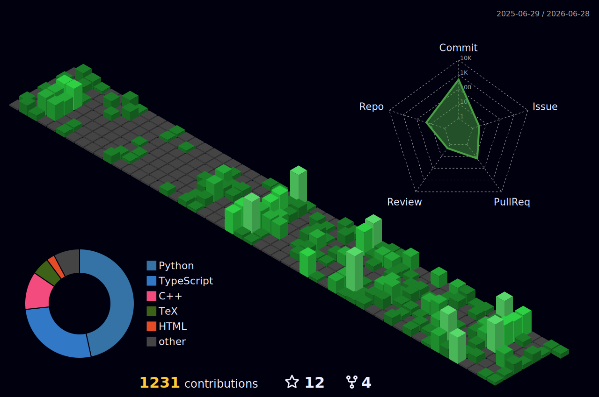

  <h1>⚠ 施工中 ⚠</h1>

  <h1>Hi there, I'm Vanilla Yukirin 👋</h1>
  
<b>ACMer | MCMer | AFOIer | Data Science & Big Data Technology</b>

  

### 🍓 About Me

- 🌱 Currently studying **Data Science and Big Data Technology**.
- 🎮 Love playing **GalGames** (Visual Novels) and tinkering with interesting things.
- 💻 **Goal:** Become an algorithm engineer who solves tough problems with clever code.
- ✨ **Hope:** To use code and math to create miracles, making the world just a little more interesting 😊.

  

### 🛠️ Tech Stack

  

### 📕 Latest Blog Posts

#### Citation Style
<!-- BLOG-POST-LIST-CITE:START -->- [零刻GTi13Ultra进入BIOS切换显卡PCIe通道](http://vanilla-chan.cn/blog/2026/03/05/GTi13Ultra-BIOS-PCIe-Configuration/), `2026-03-06 05:42`
- [21岁。](http://vanilla-chan.cn/blog/2026/03/02/checkpoint-at-21/), `2026-03-02 12:10`
- [Z-Image-Turbo进行LoRA微调流程](http://vanilla-chan.cn/blog/2026/02/14/Z-Image-Turbo-Finetune-LoRA/), `2026-02-14 23:53`
- [解决Windows11端口被随机占用的问题](http://vanilla-chan.cn/blog/2026/02/13/fix-win11-port-occupied/), `2026-02-13 18:49`
- [仅通过一句提示词，就可以让大模型变得更有创造力](http://vanilla-chan.cn/blog/2025/12/17/Verbalized-Sampling/), `2025-12-17 14:14`
<!-- BLOG-POST-LIST-CITE:END -->

#### Table Style
<!-- BLOG-POST-LIST-TABLE:START -->| [零刻GTi13Ultra进入BIOS切换显卡PCIe通道](http://vanilla-chan.cn/blog/2026/03/05/GTi13Ultra-BIOS-PCIe-Configuration/) | `2026-03-06 05:42` |
| [21岁。](http://vanilla-chan.cn/blog/2026/03/02/checkpoint-at-21/) | `2026-03-02 12:10` |
| [Z-Image-Turbo进行LoRA微调流程](http://vanilla-chan.cn/blog/2026/02/14/Z-Image-Turbo-Finetune-LoRA/) | `2026-02-14 23:53` |
| [解决Windows11端口被随机占用的问题](http://vanilla-chan.cn/blog/2026/02/13/fix-win11-port-occupied/) | `2026-02-13 18:49` |
| [仅通过一句提示词，就可以让大模型变得更有创造力](http://vanilla-chan.cn/blog/2025/12/17/Verbalized-Sampling/) | `2025-12-17 14:14` |
<!-- BLOG-POST-LIST-TABLE:END -->

### 📊 GitHub Stats

<!-- 左 Stats & 右 Languages-->

  
  

<!-- 贪吃蛇 -->

  <picture>
    <source media="(prefers-color-scheme: dark)" srcset="https://raw.githubusercontent.com/Vanilla-Yukirin/Vanilla-Yukirin/output/github-contribution-grid-snake-dark.svg">
    <source media="(prefers-color-scheme: light)" srcset="https://raw.githubusercontent.com/Vanilla-Yukirin/Vanilla-Yukirin/output/github-contribution-grid-snake.svg">
    
  </picture>

### 📈 More Activity

  
<b>✨ Click to expand ✨</b>

   
  

    
      
    
  

### 👀 Visitor Count

  

